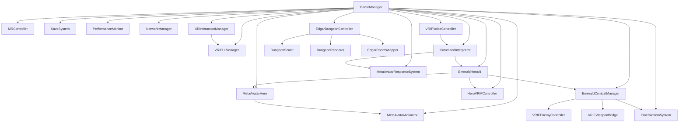

# System Diagram - VR Dungeon Game

This diagram shows the relationships between major classes and systems.

---

---

**Legend:**
- Arrows indicate primary control or data flow.
- Managers coordinate subsystems and handle events.
- See code comments for more details. 